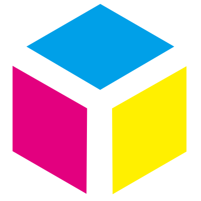

# MMK Admin
<a href="https://mmk-admin.vercel.app/" target="_blank">
 
</a> 

## Introduction
MMK Shop is a full-stack e-commerce demo built with a modular architecture. It provides a Shop frontend for customers, an Admin dashboard for management, a Backend server for handling business logic and APIs, and a Database for persistent data storage.

    ┌─────────────────┐         ┌──────────────────┐
    │ Shop (Frontend) │         │ Admin (Frontend) │
    └─────────────────┘         └──────────────────┘
              ▲                           ▲
              │  API Requests / Responses │ 
              └─────────────┬─────────────┘
                            ▼             
                  ┌──────────────────┐  
                  │ Backend (Server) │ 
                  └─────────┬────────┘
                            │ Read/Write Data
                            ▼
                    ┌────────────────┐
                    │    Database    │
                    └────────────────┘

## Features
* manage products (add/edit/delete).
* track inventory and stock levels.
* view and process customer orders.
* see sales analytics and reports.
* communicates with the APIs to update data, manage orders.

## Tech Stack

| Layer        | Technology |
| ------------ | ---------- |
| Framework    | [React.js](https://react.dev/) with [TypeScript](https://www.typescriptlang.org/) + [Vite](https://vitejs.dev/) |
| Deployment   | [Vercel](https://vercel.com/) |
| Database      | [Supabase](https://supabase.com/) (PostgreSQL)                              |
| Icons        | [Lucide](https://lucide.dev/) |
